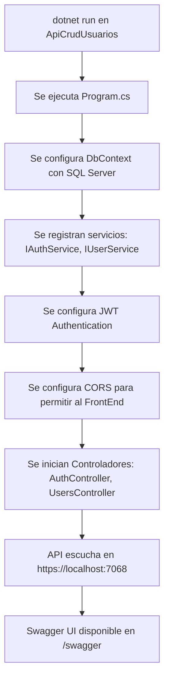
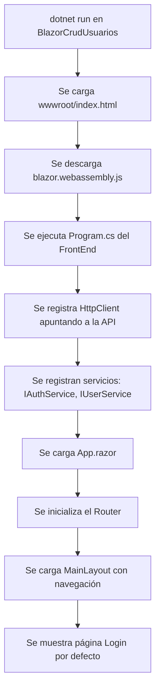
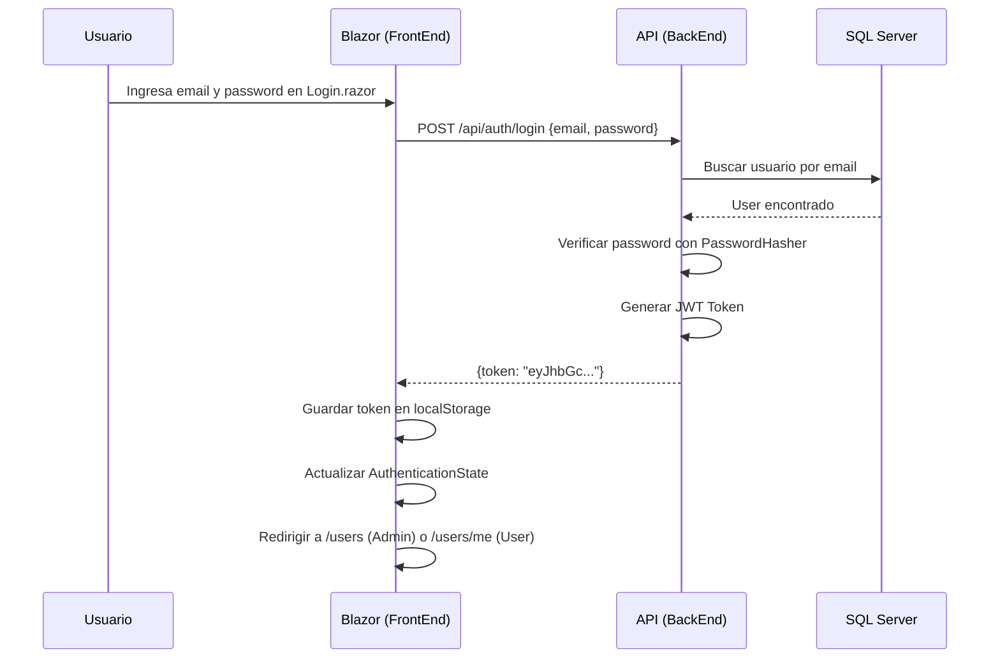
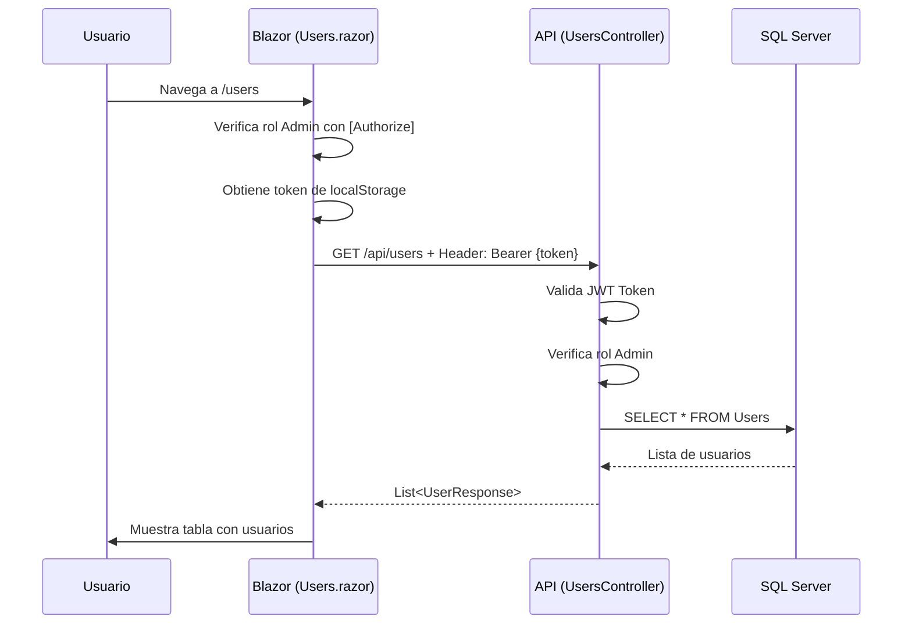
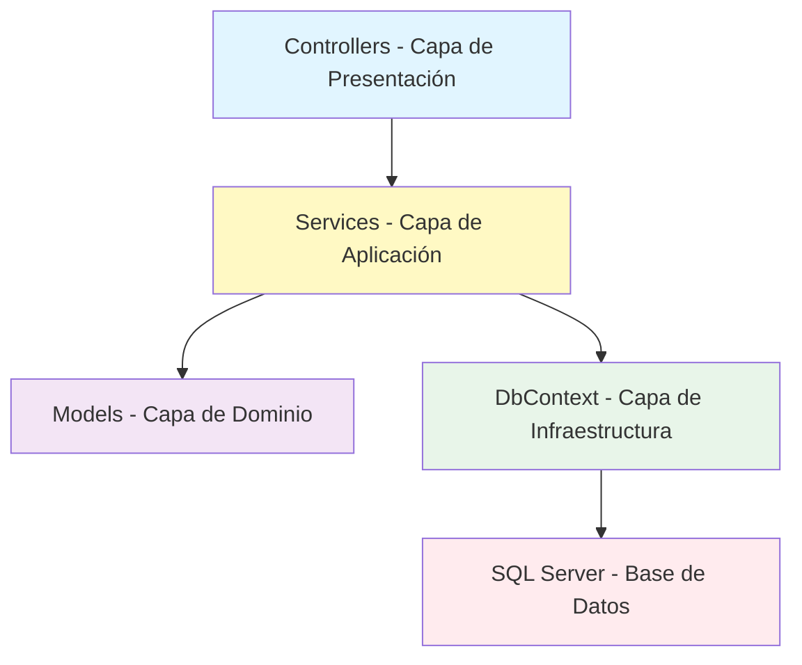
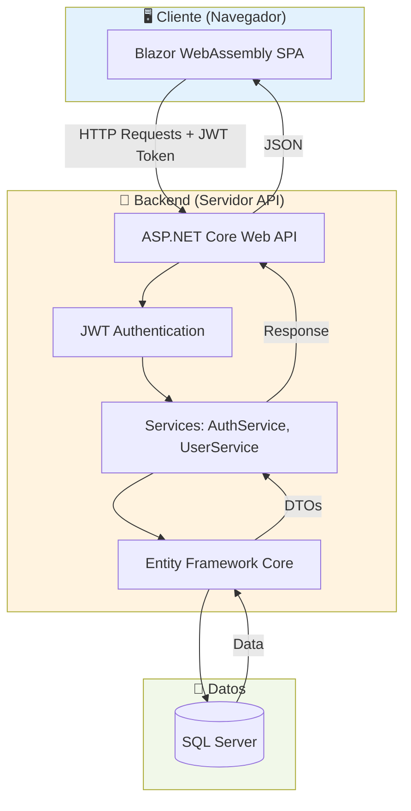

# 01 - Descripción General del Proyecto

## 📌 Objetivo General de la Aplicación

Esta aplicación es un **CRUD de Usuarios** (Create, Read, Update, Delete - Crear, Leer, Actualizar, Eliminar) que permite gestionar usuarios con autenticación y autorización basada en roles (Admin y User).

## 🎯 Problema que Resuelve

La aplicación soluciona la necesidad de:
- **Registrar y autenticar usuarios** de forma segura
- **Gestionar usuarios** (crear, listar, editar y eliminar)
- **Controlar el acceso** mediante roles (Admin tiene acceso completo, User solo puede ver su perfil)
- **Proteger rutas y funcionalidades** mediante autenticación JWT (JSON Web Tokens)

## 🏗️ Arquitectura General

La solución se compone de **DOS proyectos separados** dentro de una misma solución (.sln):

### 1. **BackEnd**: ApiCrudUsuarios
   - **Tecnología**: ASP.NET Core Web API (.NET 8)
   - **Responsabilidad**: Exponer endpoints HTTP para gestionar usuarios y autenticación
   - **Ubicación**: `BackEnd/ApiCrudUsuarios/`

### 2. **FrontEnd**: BlazorCrudUsuarios
   - **Tecnología**: Blazor WebAssembly (SPA)
   - **Responsabilidad**: Interfaz de usuario interactiva que consume la API
   - **Ubicación**: `FrontEnd/BlazorCrudUsuarios/`

### 3. **Base de Datos**: SQL Server
   - Contenedor Docker con SQL Server 2022
   - Conexión: `localhost:1433`
   - Contraseña: `Lagp2026.`

## 📂 Estructura de Carpetas

```
CrudUsuarios/
│
├── CrudUsuarios.sln                    # Solución que contiene ambos proyectos
├── docker-compose.yml                  # Configuración de SQL Server en Docker
│
├── BackEnd/                            # 🔴 Proyecto Backend (API)
│   └── ApiCrudUsuarios/
│       ├── ApiCrudUsuarios.csproj      # Archivo de proyecto .NET
│       ├── appsettings.json            # Configuración general
│       ├── appsettings.Development.json # Configuración para desarrollo
│       │
│       └── src/
│           ├── WebApi/
│           │   ├── Program.cs          # ⭐ Punto de entrada de la API
│           │   ├── Controllers/        # Controladores (AuthController, UsersController)
│           │   └── Swagger/            # Configuración de Swagger
│           │
│           ├── Application/            # Lógica de negocio
│           │   ├── Services/           # Implementación de servicios
│           │   ├── Interfaces/         # Contratos de servicios
│           │   ├── Dtos/               # Objetos de transferencia de datos
│           │   └── Exceptions/         # Excepciones personalizadas
│           │
│           ├── Domain/                 # Modelos de dominio
│           │   ├── Models/             # Entidades (User)
│           │   └── Constants/          # Constantes (Roles)
│           │
│           └── Infrastructure/         # Infraestructura
│               ├── Data/               # Contexto de base de datos (EF Core)
│               └── Migrations/         # Migraciones de base de datos
│
└── FrontEnd/                           # 🔵 Proyecto Frontend (Blazor SPA)
    └── BlazorCrudUsuarios/
        ├── BlazorCrudUsuarios.csproj   # Archivo de proyecto Blazor
        ├── Program.cs                  # ⭐ Punto de entrada de Blazor
        ├── App.razor                   # Componente raíz
        ├── _Imports.razor              # Importaciones globales
        │
        ├── wwwroot/                    # Archivos estáticos
        │   ├── index.html              # HTML principal
        │   └── css/                    # Estilos
        │
        └── src/
            ├── UI/
            │   ├── Pages/              # Páginas Razor (Login, Users, etc.)
            │   ├── Components/         # Componentes reutilizables
            │   └── Layouts/            # Layouts (MainLayout)
            │
            ├── Application/
            │   ├── Services/           # Servicios del frontend
            │   ├── Interfaces/         # Contratos de servicios
            │   └── Models/             # Modelos de datos (DTOs)
            │
            └── Shared/
                └── Constants/          # Constantes (ApiRoutes)
```

## 🔄 Cómo Conviven FrontEnd y BackEnd

Aunque están en la misma solución, son **proyectos completamente independientes**:

| Aspecto | BackEnd (API) | FrontEnd (Blazor) |
|---------|---------------|-------------------|
| **Puerto por defecto** | `https://localhost:7068` | `https://localhost:7025` |
| **Ejecución** | Se ejecuta como servidor API | Se ejecuta como aplicación web SPA |
| **Comunicación** | Expone endpoints REST | Consume endpoints REST vía HTTP |
| **Tecnología** | ASP.NET Core Web API | Blazor WebAssembly |
| **Base de datos** | Accede a SQL Server vía Entity Framework | NO accede a la BD directamente |

### 📡 Comunicación

```
Usuario → Navegador Web → Blazor (SPA) → HTTP Request → API (BackEnd) → SQL Server
                              ↓                           ↓
                         JavaScript           Entity Framework Core
```

## 🔄 Flujo Completo de Ejecución

### Inicio del BackEnd (API):



### Inicio del FrontEnd (Blazor):



### Flujo de Login:



### Flujo de Obtener Usuarios (Admin):



## 🛠️ Tecnologías Utilizadas

### BackEnd (API):
- **.NET 8.0**: Framework de desarrollo
- **ASP.NET Core Web API**: Para crear la API REST
- **Entity Framework Core 8.0**: ORM para acceso a datos
- **SQL Server**: Base de datos relacional
- **JWT (JSON Web Tokens)**: Autenticación basada en tokens
- **Swagger**: Documentación interactiva de la API
- **ASP.NET Core Identity (PasswordHasher)**: Para hashear contraseñas

### FrontEnd (Blazor):
- **.NET 8.0**: Framework de desarrollo
- **Blazor WebAssembly**: Framework SPA de Microsoft
- **MudBlazor 9.5.0**: Librería de componentes UI (Material Design)
- **HttpClient**: Para consumir la API
- **AuthenticationStateProvider**: Gestión de autenticación
- **JavaScript Interop**: Para acceder a localStorage del navegador

### Infraestructura:
- **Docker & Docker Compose**: Para SQL Server
- **Git**: Control de versiones

## 📦 Dependencias Importantes

### BackEnd (ApiCrudUsuarios.csproj):
```xml
<PackageReference Include="Microsoft.AspNetCore.Authentication.JwtBearer" Version="8.0.26" />
<PackageReference Include="Microsoft.EntityFrameworkCore" Version="8.0.26" />
<PackageReference Include="Microsoft.EntityFrameworkCore.SqlServer" Version="8.0.26" />
<PackageReference Include="Swashbuckle.AspNetCore" Version="6.6.2" />
```

### FrontEnd (BlazorCrudUsuarios.csproj):
```xml
<PackageReference Include="Microsoft.AspNetCore.Components.WebAssembly" Version="8.0.28" />
<PackageReference Include="Microsoft.AspNetCore.Components.Authorization" Version="8.0.26" />
<PackageReference Include="MudBlazor" Version="9.5.0" />
<PackageReference Include="System.IdentityModel.Tokens.Jwt" Version="8.19.1" />
```

## 🔗 Relación entre las Diferentes Capas

### Arquitectura por Capas del BackEnd:



**Ejemplo concreto:**

1. **Usuario hace login** → `AuthController` recibe la petición
2. **Controller llama al servicio** → `IAuthService.Login()`
3. **Servicio aplica lógica** → `AuthService` valida credenciales con `PasswordHasher`
4. **Servicio accede a datos** → `AppDbContext` consulta `Users` en SQL Server
5. **Servicio genera JWT** → Usa configuración `JWT:KEY`
6. **Controller devuelve respuesta** → `LoginResponse { Token = "..." }`

### Relación FrontEnd con BackEnd:

```
BlazorCrudUsuarios (FrontEnd)           ApiCrudUsuarios (BackEnd)
─────────────────────────────           ─────────────────────────
Pages/Login.razor                       Controllers/AuthController
    ↓ inyecta                               ↓ usa
Services/AuthService                    Application/Services/AuthService
    ↓ usa                                   ↓ accede
Models/LoginRequest                     Infrastructure/Data/AppDbContext
    ↓ envía por HTTP                        ↓ consulta
Constants/ApiRoutes.Auth.Login          SQL Server Database
```

## 📊 Diagrama de Flujo General



## 🎓 Conceptos Clave para Principiantes

### ¿Qué es una API REST?
Es un servidor que expone **endpoints** (URLs) que permiten realizar operaciones mediante métodos HTTP:
- `GET`: Obtener datos
- `POST`: Crear datos
- `PUT`: Actualizar datos
- `DELETE`: Eliminar datos

### ¿Qué es Blazor WebAssembly?
Es una tecnología de Microsoft que permite ejecutar código C# directamente en el navegador (sin JavaScript). La aplicación se descarga completamente al navegador del usuario.

### ¿Qué es JWT?
JSON Web Token es un estándar de autenticación donde el servidor genera un token (cadena de texto cifrada) que el cliente envía en cada petición para probar su identidad.

### ¿Qué es Entity Framework Core?
Es un ORM (Object-Relational Mapper) que permite trabajar con bases de datos usando objetos C# en lugar de escribir SQL directamente.

### ¿Qué es la Inyección de Dependencias?
Es un patrón de diseño donde las clases no crean sus dependencias, sino que las reciben desde el exterior. En .NET se configura en `Program.cs` con `builder.Services.AddScoped<>()`.

## 🚀 Cómo Ejecutar la Aplicación

1. **Iniciar SQL Server**:
   ```bash
   docker-compose up -d
   ```

2. **Ejecutar BackEnd**:
   ```bash
   cd BackEnd/ApiCrudUsuarios
   dotnet run
   ```
   - API disponible en: `https://localhost:7068`
   - Swagger UI en: `https://localhost:7068/swagger`

3. **Ejecutar FrontEnd**:
   ```bash
   cd FrontEnd/BlazorCrudUsuarios
   dotnet run
   ```
   - Aplicación web en: `https://localhost:7025`

4. **Usuario de prueba**:
   - Debes registrarte en `/register` o crear un usuario manualmente en la base de datos

---

**Nota**: Esta documentación está orientada a estudiantes que están aprendiendo .NET, Blazor y desarrollo web. Cada concepto será explicado en detalle en los siguientes documentos.

