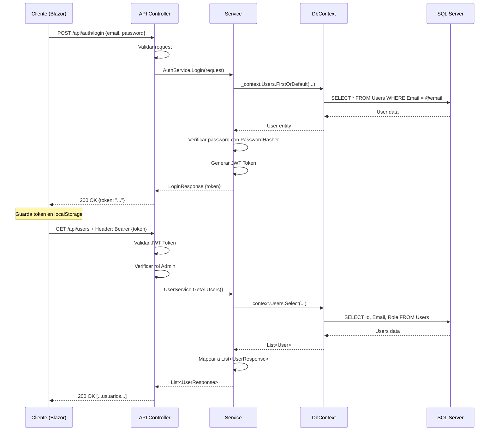

# 03 - Backend con ASP.NET Core Web API

## 🎯 ¿Qué es una Web API?

Una **Web API** (Application Programming Interface) es un servidor que:
- **Expone endpoints** (URLs) para realizar operaciones
- **Recibe peticiones HTTP** (GET, POST, PUT, DELETE)
- **Procesa datos** y aplica lógica de negocio
- **Devuelve respuestas** en formato JSON
- **No tiene interfaz gráfica** (la interfaz es responsabilidad del frontend)

## 🏗️ Arquitectura del BackEnd

Este proyecto sigue una **arquitectura en capas** para separar responsabilidades:

```
┌─────────────────────────────────────────┐
│    WebApi (Presentación)                │
│    - Controllers                        │
│    - Program.cs                         │
│    - Configuración de servicios         │
└────────────────┬────────────────────────┘
                 │
┌────────────────▼────────────────────────┐
│    Application (Lógica de Negocio)      │
│    - Services                           │
│    - Interfaces                         │
│    - DTOs                               │
│    - Exceptions                         │
└────────────────┬────────────────────────┘
                 │
┌────────────────▼────────────────────────┐
│    Domain (Modelos de Dominio)          │
│    - Models (User)                      │
│    - Constants (Roles)                  │
└─────────────────────────────────────────┘
                 │
┌────────────────▼────────────────────────┐
│    Infrastructure (Acceso a Datos)      │
│    - Data (DbContext)                   │
│    - Migrations                         │
└────────────────┬────────────────────────┘
                 │
┌────────────────▼────────────────────────┐
│    SQL Server (Base de Datos)           │
└─────────────────────────────────────────┘
```

## 📂 Estructura del BackEnd

```
BackEnd/ApiCrudUsuarios/
│
├── ApiCrudUsuarios.csproj              # Archivo de proyecto
├── appsettings.json                    # Configuración general
├── appsettings.Development.json        # Configuración para desarrollo
│
└── src/
    ├── WebApi/                         # 🎯 Capa de Presentación
    │   ├── Program.cs                  # ⭐ Punto de entrada
    │   ├── Controllers/
    │   │   ├── AuthController.cs       # Endpoints de autenticación
    │   │   └── UsersController.cs      # Endpoints de usuarios
    │   └── Swagger/
    │       └── AuthOperationFilter.cs  # Configuración de Swagger
    │
    ├── Application/                    # 🔧 Capa de Aplicación
    │   ├── Services/
    │   │   ├── AuthService.cs          # Lógica de autenticación
    │   │   └── UserService.cs          # Lógica de gestión de usuarios
    │   ├── Interfaces/
    │   │   ├── IAuthService.cs
    │   │   └── IUserService.cs
    │   ├── Dtos/
    │   │   ├── Request/
    │   │   │   ├── LoginRequest.cs
    │   │   │   ├── RegisterRequest.cs
    │   │   │   └── UpdateUserRequest.cs
    │   │   └── Response/
    │   │       ├── LoginResponse.cs
    │   │       └── UserResponse.cs
    │   └── Exceptions/
    │       ├── UserNotFoundException.cs
    │       ├── UserAlreadyExistsException.cs
    │       └── InvalidCredentialsException.cs
    │
    ├── Domain/                         # 📦 Capa de Dominio
    │   ├── Models/
    │   │   └── User.cs                 # Entidad principal
    │   └── Constants/
    │       └── Roles.cs                # Constantes de roles
    │
    └── Infrastructure/                 # 🔌 Capa de Infraestructura
        └── Data/
            └── AppDbContext.cs         # Contexto de Entity Framework
```

---

## ⭐ Program.cs - Punto de Entrada

**Ruta**: `BackEnd/ApiCrudUsuarios/src/WebApi/Program.cs`

**Propósito**: Configurar e iniciar la aplicación Web API.

### 1. Configuración de Base de Datos

```csharp
builder.Services.AddDbContext<AppDbContext>(options =>
    options.UseSqlServer(
        builder.Configuration.GetConnectionString("DefaultConnection")
    )
);
```

**Qué hace:**
- Registra `AppDbContext` para usar Entity Framework Core
- Configura SQL Server como base de datos
- Lee la cadena de conexión desde `appsettings.json`

---

### 2. Configuración de JWT Authentication

```csharp
var key = builder.Configuration["JWT:KEY"];

if (string.IsNullOrEmpty(key))
{
    throw new Exception("JWT:KEY no configurado");
}

builder.Services.AddAuthentication(options =>
{
    options.DefaultAuthenticateScheme = JwtBearerDefaults.AuthenticationScheme;
    options.DefaultChallengeScheme = JwtBearerDefaults.AuthenticationScheme;
})
.AddJwtBearer(options =>
{
    options.TokenValidationParameters = new TokenValidationParameters
    {
        ValidateIssuer = false,
        ValidateAudience = false,
        ValidateLifetime = true,
        ValidateIssuerSigningKey = true,
        IssuerSigningKey = new SymmetricSecurityKey(
            Encoding.UTF8.GetBytes(key)
        )
    };
    
    // Manejo de errores de autenticación
    options.Events = new JwtBearerEvents
    {
        OnChallenge = async context =>
        {
            context.HandleResponse();
            context.Response.StatusCode = 401;
            context.Response.ContentType = "application/json";
            await context.Response.WriteAsync("""{"error": "No estás autenticado"}""");
        },
        
        OnForbidden = async context =>
        {
            context.Response.StatusCode = 403;
            context.Response.ContentType = "application/json";
            await context.Response.WriteAsync("""{"error": "No tienes permisos"}""");
        }
    };
});
```

**Qué hace:**
- Habilita autenticación JWT
- Valida tokens en cada petición protegida
- Personaliza mensajes de error

---

### 3. Registro de Servicios (Inyección de Dependencias)

```csharp
builder.Services.AddScoped<IAuthService, AuthService>();
builder.Services.AddScoped<IPasswordHasher<User>, PasswordHasher<User>>();
builder.Services.AddScoped<IUserService, UserService>();
```

**Qué hace:**
- `AddScoped`: Crea una instancia por cada petición HTTP
- Permite inyectar servicios en controladores y otros servicios

---

### 4. Configuración de CORS

```csharp
builder.Services.AddCors(options =>
{
    options.AddPolicy("AllowFrontend",
        policy =>
            policy.WithOrigins("http://localhost:5191", "https://localhost:7025")
                .AllowAnyMethod()
                .AllowAnyHeader());
});
```

**Qué hace:**
- Permite peticiones desde el frontend Blazor
- Sin CORS, el navegador bloquearía las peticiones por seguridad

---

### 5. Configuración de Swagger

```csharp
builder.Services.AddSwaggerGen(options =>
{
    options.AddSecurityDefinition("Bearer", new OpenApiSecurityScheme
    {
        Name = "Authorization",
        Type = SecuritySchemeType.Http,
        Scheme = "bearer",
        BearerFormat = "JWT",
        In = ParameterLocation.Header,
        Description = "Escribe: Bearer {tu token}"
    });
    
    options.OperationFilter<AuthOperationFilter>();
});
```

**Qué hace:**
- Habilita documentación interactiva de la API
- Permite probar endpoints con JWT desde Swagger UI

---

### 6. Middleware Pipeline

```csharp
app.UseCors("AllowFrontend");           // Habilitar CORS
app.UseHttpsRedirection();              // Forzar HTTPS
app.UseSwagger();                       // Documentación
app.UseSwaggerUI();                     // Interfaz de Swagger
app.UseExceptionHandler(...);           // Manejo global de errores
app.UseAuthentication();                // Autenticación JWT
app.UseAuthorization();                 // Autorización por roles
app.UseStatusCodePages(...);            // Manejo de códigos de estado
app.MapControllers();                   // Mapear controladores
app.Run();                              // Ejecutar aplicación
```

**¿Qué es Middleware?**
Componentes que procesan cada petición HTTP en orden. Cada middleware puede:
- Procesar la petición
- Pasar al siguiente middleware
- Devolver una respuesta

---

### 7. Manejo Global de Errores

```csharp
app.UseExceptionHandler(errorApp =>
{
    errorApp.Run(async context =>
    {
        var exception = context.Features.Get<IExceptionHandlerPathFeature>()?.Error;
        
        context.Response.ContentType = "application/json";
        
        switch (exception)
        {
            case UserNotFoundException:
                context.Response.StatusCode = 404;
                break;
            case UserAlreadyExistsException:
                context.Response.StatusCode = 400;
                break;
            case InvalidCredentialsException:
                context.Response.StatusCode = 401;
                break;
            default:
                context.Response.StatusCode = 500;
                break;
        }
        
        var response = new { error = exception?.Message };
        await context.Response.WriteAsJsonAsync(response);
    });
});
```

**Qué hace:**
- Captura todas las excepciones no manejadas
- Convierte excepciones en respuestas HTTP apropiadas
- Devuelve JSON con el mensaje de error

---

## 🎮 Controllers - Controladores

Los controladores reciben peticiones HTTP y delegan la lógica a los servicios.

### AuthController.cs

**Ruta**: `BackEnd/ApiCrudUsuarios/src/WebApi/Controllers/AuthController.cs`

**Propósito**: Gestionar autenticación (registro y login).

**Ruta base**: `api/auth`

#### Endpoints:

##### 1. POST /api/auth/register
```csharp
[HttpPost("register")]
public IActionResult Register(RegisterRequest request)
{
    // Validaciones
    if (string.IsNullOrWhiteSpace(request.Email))
        return BadRequest("Email es requerido");
    
    if (string.IsNullOrWhiteSpace(request.Password))
        return BadRequest("Password es requerido");
    
    if (request.Password.Length < 6)
        return BadRequest("Password debe tener mínimo 6 caracteres");
    
    if (!request.Email.Contains("@"))
        return BadRequest("Email inválido");
    
    _authService.Register(request);
    
    return Ok("Usuario registrado exitosamente");
}
```

**Entrada:**
```json
{
  "email": "usuario@example.com",
  "password": "123456"
}
```

**Salida exitosa (200):**
```json
"Usuario registrado exitosamente"
```

**Archivos involucrados:**
- `AuthController.cs` → `AuthService.cs` → `AppDbContext.cs` → SQL Server

---

##### 2. POST /api/auth/login
```csharp
[HttpPost("login")]
public IActionResult Login(LoginRequest request)
{
    // Validaciones
    if (string.IsNullOrWhiteSpace(request.Email))
        return BadRequest("Email es requerido");
    
    if (string.IsNullOrWhiteSpace(request.Password))
        return BadRequest("Password es requerido");
    
    var result = _authService.Login(request);
    
    return Ok(result);
}
```

**Entrada:**
```json
{
  "email": "admin@example.com",
  "password": "Admin123"
}
```

**Salida exitosa (200):**
```json
{
  "token": "eyJhbGciOiJIUzI1NiIsInR5cCI6IkpXVCJ9..."
}
```

**Archivos involucrados:**
- `AuthController.cs` → `AuthService.cs` → `AppDbContext.cs`

---

##### 3. GET /api/auth/profile
```csharp
[HttpGet("profile")]
[Authorize]
public IActionResult Profile()
{
    return Ok("Usuario autenticado ✅");
}
```

**Requiere**: JWT Token en header `Authorization: Bearer {token}`

**Salida (200):**
```json
"Usuario autenticado ✅"
```

---

##### 4. GET /api/auth/admin
```csharp
[HttpGet("admin")]
[Authorize(Roles = Roles.Admin)]
public IActionResult OnlyAdmin()
{
    return Ok("Solo acceso para Admin 🔒");
}
```

**Requiere**: JWT Token con rol Admin

**Salida (200):**
```json
"Solo acceso para Admin 🔒"
```

---

### UsersController.cs

**Ruta**: `BackEnd/ApiCrudUsuarios/src/WebApi/Controllers/UsersController.cs`

**Propósito**: Gestionar operaciones CRUD de usuarios.

**Ruta base**: `api/users`

#### Endpoints:

##### 1. GET /api/users
```csharp
[HttpGet]
[Authorize(Roles = Roles.Admin)]
public IActionResult GetAllUsers()
{
    var users = _userService.GetAllUsers();
    return Ok(users);
}
```

**Requiere**: JWT Token con rol Admin

**Salida (200):**
```json
[
  {
    "id": 1,
    "email": "admin@example.com",
    "role": "Admin"
  },
  {
    "id": 2,
    "email": "user@example.com",
    "role": "User"
  }
]
```

**Archivos involucrados:**
- `UsersController.cs` → `UserService.cs` → `AppDbContext.cs`

---

##### 2. GET /api/users/me
```csharp
[HttpGet("me")]
[Authorize]
public IActionResult GetMyUser()
{
    var userId = int.Parse(User.FindFirst(ClaimTypes.NameIdentifier)!.Value);
    var user = _userService.GetMyUser(userId);
    return Ok(user);
}
```

**Requiere**: JWT Token

**Salida (200):**
```json
{
  "id": 2,
  "email": "user@example.com",
  "role": "User"
}
```

**Cómo obtiene el ID del usuario:**
```csharp
User.FindFirst(ClaimTypes.NameIdentifier)!.Value
```
El JWT contiene claims (información), uno de ellos es el ID del usuario.

---

##### 3. POST /api/users
```csharp
[HttpPost]
[Authorize(Roles = Roles.Admin)]
public IActionResult CreateUser(RegisterRequest request)
{
    // Validaciones...
    
    _userService.CreateUser(request);
    
    return Ok("Usuario creado por Admin ✅");
}
```

**Requiere**: JWT Token con rol Admin

**Entrada:**
```json
{
  "email": "nuevo@example.com",
  "password": "123456"
}
```

**Salida (200):**
```json
"Usuario creado por Admin ✅"
```

---

##### 4. PUT /api/users/{id}
```csharp
[HttpPut("{id}")]
[Authorize]
public IActionResult UpdateUser(int id, UpdateUserRequest request)
{
    var currentUserId = int.Parse(User.FindFirst(ClaimTypes.NameIdentifier)!.Value);
    var currentUserRole = User.FindFirst(ClaimTypes.Role)!.Value;
    
    // User solo puede editarse a sí mismo
    if (currentUserRole != Roles.Admin && currentUserId != id)
        return Forbid();
    
    _userService.UpdateUser(id, request, currentUserRole);
    
    return Ok("Usuario actualizado ✅");
}
```

**Requiere**: JWT Token

**Entrada:**
```json
{
  "email": "nuevoemail@example.com",
  "password": "nuevopassword",
  "role": "Admin"  // Solo Admin puede cambiar el rol
}
```

**Salida (200):**
```json
"Usuario actualizado ✅"
```

---

##### 5. DELETE /api/users/{id}
```csharp
[HttpDelete("{id}")]
[Authorize(Roles = Roles.Admin)]
public IActionResult DeleteUser(int id)
{
    var currentUserId = int.Parse(User.FindFirst(ClaimTypes.NameIdentifier)!.Value);
    
    // Validar que no se elimine a sí mismo
    if (currentUserId == id)
    {
        return BadRequest("No puedes eliminarte a ti mismo");
    }
    
    _userService.DeleteUser(id);
    
    return Ok("Usuario eliminado ✅");
}
```

**Requiere**: JWT Token con rol Admin

**Salida (200):**
```json
"Usuario eliminado ✅"
```

---

## 🔧 Services - Servicios

### AuthService.cs

**Ruta**: `BackEnd/ApiCrudUsuarios/src/Application/Services/AuthService.cs`

**Propósito**: Implementar lógica de autenticación.

**Dependencias:**
- `AppDbContext`: Acceso a base de datos
- `IPasswordHasher<User>`: Para hashear/verificar contraseñas
- `IConfiguration`: Para leer configuración (JWT:KEY)

#### Método: Register

```csharp
public void Register(RegisterRequest request)
{
    // Verificar si el usuario ya existe
    if (_context.Users.Any(u => u.Email == request.Email))
        throw new UserAlreadyExistsException();
    
    // Crear usuario
    var user = new User
    {
        Email = request.Email,
        PasswordHash = "",
        Role = Roles.User  // Rol por defecto
    };
    
    // Hashear contraseña
    user.PasswordHash = _passwordHasher.HashPassword(user, request.Password);
    
    // Validar modelo
    user.Validate();
    
    // Guardar en base de datos
    _context.Users.Add(user);
    _context.SaveChanges();
}
```

**Qué hace:**
1. Verifica que el email no exista
2. Crea un nuevo usuario con rol "User"
3. Hashea la contraseña (nunca se guarda en texto plano)
4. Valida el modelo
5. Guarda en la base de datos

---

#### Método: Login

```csharp
public LoginResponse Login(LoginRequest request)
{
    // Buscar usuario por email
    var user = _context.Users.FirstOrDefault(u => u.Email == request.Email);
    
    if (user == null)
        throw new UserNotFoundException();
    
    // Verificar contraseña
    var result = _passwordHasher.VerifyHashedPassword(
        user,
        user.PasswordHash,
        request.Password
    );
    
    if (result == PasswordVerificationResult.Failed)
        throw new InvalidCredentialsException();
    
    // Obtener clave JWT
    var keyString = _configuration["JWT:KEY"];
    if (string.IsNullOrEmpty(keyString))
        throw new Exception("JWT:KEY no configurado");
    
    var key = new SymmetricSecurityKey(Encoding.UTF8.GetBytes(keyString));
    var creds = new SigningCredentials(key, SecurityAlgorithms.HmacSha256);
    
    // Crear claims (información del token)
    var claims = new[]
    {
        new Claim(ClaimTypes.Email, user.Email),
        new Claim(ClaimTypes.NameIdentifier, user.Id.ToString()),
        new Claim(ClaimTypes.Role, user.Role)
    };
    
    // Crear token JWT
    var token = new JwtSecurityToken(
        claims: claims,
        expires: DateTime.Now.AddHours(1),
        signingCredentials: creds
    );
    
    // Generar token string
    var jwt = new JwtSecurityTokenHandler().WriteToken(token);
    
    return new LoginResponse { Token = jwt };
}
```

**Qué hace:**
1. Busca usuario por email
2. Verifica la contraseña con `PasswordHasher`
3. Crea claims (email, id, rol)
4. Genera un JWT token válido por 1 hora
5. Devuelve el token

---

### UserService.cs

**Ruta**: `BackEnd/ApiCrudUsuarios/src/Application/Services/UserService.cs`

**Propósito**: Gestionar operaciones CRUD de usuarios.

**Dependencias:**
- `AppDbContext`
- `IPasswordHasher<User>`

#### Método: GetAllUsers

```csharp
public List<UserResponse> GetAllUsers()
{
    return _context.Users
        .Select(u => new UserResponse
        {
            Id = u.Id,
            Email = u.Email,
            Role = u.Role
        })
        .ToList();
}
```

---

#### Método: GetMyUser

```csharp
public UserResponse GetMyUser(int userId)
{
    var user = _context.Users.FirstOrDefault(u => u.Id == userId);
    
    if (user == null)
        throw new UserNotFoundException();
    
    return new UserResponse
    {
        Id = user.Id,
        Email = user.Email,
        Role = user.Role
    };
}
```

---

#### Método: CreateUser

```csharp
public void CreateUser(RegisterRequest request)
{
    var normalizedEmail = request.Email.Trim().ToLowerInvariant();
    
    // Validación de negocio
    if (_context.Users.Any(u => u.Email == normalizedEmail))
        throw new UserAlreadyExistsException();
    
    var user = new User
    {
        Email = normalizedEmail,
        PasswordHash = "",
        Role = Roles.User
    };
    
    user.PasswordHash = _passwordHasher.HashPassword(user, request.Password);
    user.Validate();
    
    _context.Users.Add(user);
    _context.SaveChanges();
}
```

---

#### Método: UpdateUser

```csharp
public void UpdateUser(int id, UpdateUserRequest request, string currentUserRole)
{
    var user = _context.Users.FirstOrDefault(u => u.Id == id);
    
    if (user == null)
        throw new UserNotFoundException();
    
    // Actualizar Email
    if (!string.IsNullOrWhiteSpace(request.Email))
    {
        var newEmail = request.Email.Trim().ToLowerInvariant();
        var currentEmail = user.Email.ToLowerInvariant();
        
        if (newEmail != currentEmail)
        {
            var emailExists = _context.Users.Any(u => u.Email == newEmail);
            
            if (emailExists)
                throw new Exception("El email ya está en uso");
            
            user.Email = newEmail;
        }
    }
    
    // Actualizar Password
    if (!string.IsNullOrWhiteSpace(request.Password))
    {
        user.PasswordHash = _passwordHasher.HashPassword(user, request.Password);
    }
    
    // Actualizar Role → solo Admin
    if (!string.IsNullOrWhiteSpace(request.Role))
    {
        if (currentUserRole != Roles.Admin)
            throw new Exception("No tienes permisos para cambiar el rol");
        
        user.Role = request.Role;
    }
    
    _context.SaveChanges();
}
```

---

#### Método: DeleteUser

```csharp
public void DeleteUser(int id)
{
    var user = _context.Users.FirstOrDefault(u => u.Id == id);
    
    if (user == null)
        throw new UserNotFoundException();
    
    _context.Users.Remove(user);
    _context.SaveChanges();
}
```

---

## 📦 Domain - Modelos

### User.cs

**Ruta**: `BackEnd/ApiCrudUsuarios/src/Domain/Models/User.cs`

**Propósito**: Representar la entidad Usuario en el dominio.

```csharp
public class User
{
    public int Id { get; private set; }
    
    [MaxLength(256)]
    public required string Email { get; set; }
    
    [MaxLength(512)]
    public required string PasswordHash { get; set; }
    
    [MaxLength(50)]
    public required string Role { get; set; }
    
    public void Validate()
    {
        if (string.IsNullOrWhiteSpace(Email))
            throw new Exception("Email inválido");
        
        if (string.IsNullOrWhiteSpace(PasswordHash))
            throw new Exception("PasswordHash inválido");
    }
}
```

**Propiedades:**
- `Id`: Identificador único (auto-incremental)
- `Email`: Correo del usuario (máximo 256 caracteres)
- `PasswordHash`: Contraseña hasheada (nunca en texto plano)
- `Role`: Rol del usuario (Admin o User)

---

### Roles.cs

**Ruta**: `BackEnd/ApiCrudUsuarios/src/Domain/Constants/Roles.cs`

**Propósito**: Definir constantes de roles.

```csharp
public static class Roles
{
    public const string Admin = "Admin";
    public const string User = "User";
}
```

**Uso:**
```csharp
[Authorize(Roles = Roles.Admin)]
```

---

## 📨 DTOs - Data Transfer Objects

### Request DTOs

#### LoginRequest.cs
```csharp
public class LoginRequest
{
    public required string Email { get; set; }
    public required string Password { get; set; }
}
```

#### RegisterRequest.cs
```csharp
public class RegisterRequest
{
    public required string Email { get; set; }
    public required string Password { get; set; }
}
```

#### UpdateUserRequest.cs
```csharp
public class UpdateUserRequest
{
    public string? Email { get; set; }
    public string? Password { get; set; }
    public string? Role { get; set; }  // Solo Admin
}
```

### Response DTOs

#### LoginResponse.cs
```csharp
public class LoginResponse
{
    public required string Token { get; set; }
}
```

#### UserResponse.cs
```csharp
public class UserResponse
{
    public int Id { get; set; }
    public string Email { get; set; } = string.Empty;
    public string Role { get; set; } = string.Empty;
}
```

**¿Por qué usar DTOs?**
- Separar modelos de dominio de datos expuestos al exterior
- Controlar qué información se envía/recibe
- Evitar sobre-exposición de datos sensibles (PasswordHash nunca se devuelve)

---

## ❌ Exceptions - Excepciones Personalizadas

### UserNotFoundException.cs
```csharp
public class UserNotFoundException : Exception
{
    public UserNotFoundException() 
        : base("Usuario no existe")
    {
    }
}
```

### UserAlreadyExistsException.cs
```csharp
public class UserAlreadyExistsException : Exception
{
    public UserAlreadyExistsException() 
        : base("El usuario ya existe")
    {
    }
}
```

### InvalidCredentialsException.cs
```csharp
public class InvalidCredentialsException : Exception
{
    public InvalidCredentialsException() 
        : base("Contraseña incorrecta")
    {
    }
}
```

**Uso:**
Las excepciones se capturan en el middleware global y se convierten en respuestas HTTP apropiadas.

---

## 🔌 Infrastructure - Acceso a Datos

### AppDbContext.cs

**Ruta**: `BackEnd/ApiCrudUsuarios/src/Infrastructure/Data/AppDbContext.cs`

**Propósito**: Contexto de Entity Framework para acceder a la base de datos.

```csharp
public class AppDbContext : DbContext
{
    public DbSet<User> Users { get; set; }
    
    public AppDbContext(DbContextOptions<AppDbContext> options)
        : base(options)
    {
    }
}
```

**¿Qué es DbContext?**
- Representa una sesión con la base de datos
- Permite consultar y guardar datos
- Gestiona el seguimiento de cambios

**Uso:**
```csharp
// Consultar
var users = _context.Users.ToList();

// Agregar
_context.Users.Add(user);
_context.SaveChanges();

// Actualizar
var user = _context.Users.FirstOrDefault(u => u.Id == id);
user.Email = "nuevo@email.com";
_context.SaveChanges();

// Eliminar
_context.Users.Remove(user);
_context.SaveChanges();
```

---

## ⚙️ Configuración

### appsettings.json
```json
{
  "Logging": {
    "LogLevel": {
      "Default": "Information",
      "Microsoft.AspNetCore": "Warning"
    }
  },
  "ConnectionStrings": {},
  "AllowedHosts": "*"
}
```

### appsettings.Development.json
```json
{
  "Logging": {
    "LogLevel": {
      "Default": "Information",
      "Microsoft.AspNetCore": "Warning"
    }
  },
  "HttpsRedirection": {
    "HttpsPort": 7068
  }
}
```

**Nota**: La cadena de conexión y JWT:KEY deberían estar configuradas (probablemente mediante variables de entorno o user secrets).

---

## 🔐 Seguridad

### 1. Autenticación JWT
```csharp
[Authorize]  // Requiere estar autenticado
```

### 2. Autorización por Roles
```csharp
[Authorize(Roles = Roles.Admin)]  // Requiere rol Admin
```

### 3. Hashing de Contraseñas
```csharp
user.PasswordHash = _passwordHasher.HashPassword(user, request.Password);
```

**¿Por qué hashear?**
- Las contraseñas NUNCA se guardan en texto plano
- Si la base de datos es comprometida, las contraseñas están protegidas

### 4. CORS
```csharp
app.UseCors("AllowFrontend");
```

**¿Por qué CORS?**
- Controla qué orígenes pueden acceder a la API
- Evita peticiones no autorizadas desde otros dominios

---

## 📊 Diagrama de Flujo de Peticiones



---

## 📋 Resumen de Endpoints

| Método | Endpoint | Autorización | Descripción |
|--------|----------|-------------|-------------|
| POST | /api/auth/register | Público | Registrar nuevo usuario |
| POST | /api/auth/login | Público | Iniciar sesión |
| GET | /api/auth/profile | Autenticado | Verificar autenticación |
| GET | /api/auth/admin | Admin | Ruta solo para Admin |
| GET | /api/users | Admin | Listar todos los usuarios |
| GET | /api/users/me | Autenticado | Obtener usuario actual |
| POST | /api/users | Admin | Crear usuario |
| PUT | /api/users/{id} | Autenticado | Actualizar usuario |
| DELETE | /api/users/{id} | Admin | Eliminar usuario |

---

## 🎓 Conceptos Clave

### ¿Qué es Inyección de Dependencias?
En lugar de que una clase cree sus dependencias:
```csharp
// ❌ Malo
public class AuthController
{
    private readonly IAuthService _authService = new AuthService();
}
```

Las recibe desde el exterior:
```csharp
// ✅ Bueno
public class AuthController
{
    private readonly IAuthService _authService;
    
    public AuthController(IAuthService authService)
    {
        _authService = authService;
    }
}
```

### ¿Qué es Entity Framework Core?
Es un ORM (Object-Relational Mapper) que permite:
- Trabajar con bases de datos usando objetos C#
- No escribir SQL manualmente
- Generar migraciones automáticamente

### ¿Qué es un JWT Token?
Es un string cifrado que contiene información (claims):
```
eyJhbGciOiJIUzI1NiIsInR5cCI6IkpXVCJ9.eyJlbWFpbCI6ImFkbWluQGV4YW1wbGUuY29tIiwiaWQiOiIxIiwicm9sZSI6IkFkbWluIn0.signature
```

Partes:
1. **Header**: Tipo de token y algoritmo
2. **Payload**: Claims (email, id, rol)
3. **Signature**: Firma para verificar autenticidad

---

**Conclusión**: El backend proporciona una API REST segura con autenticación JWT, autorización por roles, y operaciones CRUD completas para gestionar usuarios, siguiendo buenas prácticas de arquitectura en capas.

