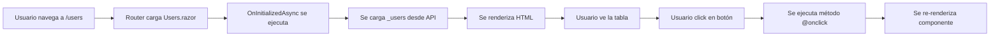

# 05 - Archivos Clave de .NET

## 📄 Program.cs

### ¿Qué es?
**Program.cs** es el **punto de entrada** de cualquier aplicación .NET. Es el primer archivo que se ejecuta cuando inicias tu aplicación.

### ¿Para qué sirve?
- **Configurar servicios** (inyección de dependencias)
- **Configurar middleware** (pipeline de procesamiento de peticiones)
- **Iniciar la aplicación**

### ¿Cuándo se ejecuta?
Se ejecuta **una sola vez** al iniciar la aplicación.

### Ubicación:
- **BackEnd**: `BackEnd/ApiCrudUsuarios/src/WebApi/Program.cs`
- **FrontEnd**: `FrontEnd/BlazorCrudUsuarios/Program.cs`

---

### Program.cs en el BackEnd (Web API)

**Estructura básica:**

```csharp
// 1️⃣ CONSTRUCCIÓN DEL HOST
var builder = WebApplication.CreateBuilder(args);

// 2️⃣ CONFIGURACIÓN DE SERVICIOS (Dependency Injection)
builder.Services.AddDbContext<AppDbContext>(options => 
    options.UseSqlServer(builder.Configuration.GetConnectionString("DefaultConnection")));

builder.Services.AddControllers();
builder.Services.AddAuthentication(...)
builder.Services.AddScoped<IAuthService, AuthService>();

// 3️⃣ CONSTRUCCIÓN DE LA APLICACIÓN
var app = builder.Build();

// 4️⃣ CONFIGURACIÓN DE MIDDLEWARE (Pipeline)
app.UseCors("AllowFrontend");
app.UseHttpsRedirection();
app.UseAuthentication();
app.UseAuthorization();
app.MapControllers();

// 5️⃣ EJECUCIÓN
app.Run();
```

**Cómo participa:**
1. Se ejecuta cuando haces `dotnet run`
2. Configura todos los servicios necesarios
3. Establece el pipeline de procesamiento
4. Inicia el servidor web en el puerto configurado

---

### Program.cs en el FrontEnd (Blazor)

**Estructura básica:**

```csharp
// 1️⃣ CREAR EL HOST
var builder = WebAssemblyHostBuilder.CreateDefault(args);

// 2️⃣ AGREGAR COMPONENTES RAÍZ
builder.RootComponents.Add<App>("#app");
builder.RootComponents.Add<HeadOutlet>("head::after");

// 3️⃣ CONFIGURAR SERVICIOS
builder.Services.AddScoped(sp => new HttpClient 
{ 
    BaseAddress = new Uri("https://localhost:7068/") 
});
builder.Services.AddScoped<IAuthService, AuthService>();
builder.Services.AddAuthorizationCore();

// 4️⃣ CONSTRUIR Y EJECUTAR
await builder.Build().RunAsync();
```

**Cómo participa:**
1. Se ejecuta cuando el navegador carga la aplicación
2. Descarga la aplicación Blazor al navegador
3. Configura servicios disponibles en toda la app
4. Monta el componente `App.razor` en el HTML

---

### Buenas Prácticas:

✅ **Mantén Program.cs organizado**: Separa configuraciones complejas en métodos auxiliares
✅ **Usa configuración externa**: Lee de `appsettings.json` en lugar de hardcodear
✅ **Documenta configuraciones no obvias**: Usa comentarios para explicar decisiones

---

## ⚙️ appsettings.json

### ¿Qué es?
Archivo de **configuración de la aplicación** en formato JSON.

### ¿Para qué sirve?
- Almacenar configuraciones sin recompilar
- Configurar conexiones a bases de datos
- Definir niveles de logging
- Configurar APIs externas
- Gestionar diferentes entornos (Development, Production)

### ¿Cuándo se ejecuta?
Se **lee al iniciar** la aplicación y está disponible mediante `IConfiguration`.

### Ubicación:
`BackEnd/ApiCrudUsuarios/appsettings.json`

---

### Estructura típica:

```json
{
  "Logging": {
    "LogLevel": {
      "Default": "Information",
      "Microsoft.AspNetCore": "Warning"
    }
  },
  "ConnectionStrings": {
    "DefaultConnection": "Server=localhost,1433;Database=CrudUsuariosDB;User Id=sa;Password=Lagp2026.;TrustServerCertificate=True;"
  },
  "JWT": {
    "KEY": "mi-super-clave-secreta-minimo-32-caracteres-2026",
    "Issuer": "https://localhost:7068",
    "Audience": "https://localhost:7025"
  },
  "AllowedHosts": "*"
}
```

---

### Secciones explicadas:

#### 1. Logging
```json
"Logging": {
  "LogLevel": {
    "Default": "Information",
    "Microsoft.AspNetCore": "Warning"
  }
}
```

**Niveles de log** (de más a menos detallado):
- `Trace`: Información muy detallada (solo depuración)
- `Debug`: Información de depuración
- `Information`: Información general (por defecto)
- `Warning`: Advertencias
- `Error`: Errores
- `Critical`: Errores críticos

**Uso:**
```csharp
public class AuthService
{
    private readonly ILogger<AuthService> _logger;
    
    public AuthService(ILogger<AuthService> logger)
    {
        _logger = logger;
    }
    
    public void Login(LoginRequest request)
    {
        _logger.LogInformation("Usuario {Email} intentando login", request.Email);
        // ...
    }
}
```

---

#### 2. ConnectionStrings
```json
"ConnectionStrings": {
  "DefaultConnection": "Server=localhost,1433;Database=CrudUsuariosDB;..."
}
```

**Partes de la cadena de conexión:**
- `Server=localhost,1433`: Dirección del servidor y puerto
- `Database=CrudUsuariosDB`: Nombre de la base de datos
- `User Id=sa`: Usuario de SQL Server
- `Password=Lagp2026.`: Contraseña
- `TrustServerCertificate=True`: Confiar en el certificado SSL

**Uso:**
```csharp
builder.Services.AddDbContext<AppDbContext>(options =>
    options.UseSqlServer(
        builder.Configuration.GetConnectionString("DefaultConnection")
    )
);
```

---

#### 3. JWT
```json
"JWT": {
  "KEY": "mi-super-clave-secreta-minimo-32-caracteres-2026",
  "Issuer": "https://localhost:7068",
  "Audience": "https://localhost:7025"
}
```

**Uso:**
```csharp
var key = builder.Configuration["JWT:KEY"];
```

---

#### 4. AllowedHosts
```json
"AllowedHosts": "*"
```

Especifica qué hosts pueden acceder a la aplicación:
- `"*"`: Cualquier host (desarrollo)
- `"localhost;example.com"`: Solo estos hosts (producción)

---

### Cómo leer configuración:

```csharp
// En Program.cs o mediante inyección
var connectionString = builder.Configuration.GetConnectionString("DefaultConnection");
var jwtKey = builder.Configuration["JWT:KEY"];
var logLevel = builder.Configuration["Logging:LogLevel:Default"];

// Con inyección de dependencias
public class MiServicio
{
    private readonly IConfiguration _configuration;
    
    public MiServicio(IConfiguration configuration)
    {
        _configuration = configuration;
    }
    
    public void UsarConfiguracion()
    {
        var miValor = _configuration["MiSeccion:MiPropiedad"];
    }
}
```

---

### Buenas Prácticas:

✅ **NO guardar secretos en appsettings.json**: Usa User Secrets o variables de entorno
✅ **Usa appsettings.{Environment}.json**: Para configuraciones específicas por entorno
❌ **NO hacer commit de appsettings.Production.json**: Con datos sensibles

---

## 🔧 appsettings.Development.json

### ¿Qué es?
Archivo de configuración específico para el **entorno de desarrollo**.

### ¿Para qué sirve?
Sobrescribir valores de `appsettings.json` solo en desarrollo.

### ¿Cuándo se ejecuta?
Se carga **automáticamente** cuando `ASPNETCORE_ENVIRONMENT=Development`.

### Ubicación:
`BackEnd/ApiCrudUsuarios/appsettings.Development.json`

---

### Ejemplo:

```json
{
  "Logging": {
    "LogLevel": {
      "Default": "Debug",
      "Microsoft.AspNetCore": "Information"
    }
  },
  "ConnectionStrings": {
    "DefaultConnection": "Server=localhost,1433;Database=CrudUsuarios_Dev;..."
  },
  "HttpsRedirection": {
    "HttpsPort": 7068
  }
}
```

**Diferencias con appsettings.json:**
- Nivel de log más detallado (`Debug` en lugar de `Information`)
- Base de datos de desarrollo (`CrudUsuarios_Dev`)
- Puerto HTTPS específico

---

### Jerarquía de configuración:

```
appsettings.json                    # Base
    ↓ sobrescrito por
appsettings.Development.json        # Desarrollo
    ↓ sobrescrito por
Variables de entorno                # Producción
    ↓ sobrescrito por
User Secrets                        # Local
    ↓ sobrescrito por
Argumentos de línea de comandos     # Temporal
```

---

### Cómo participa:

```csharp
// .NET detecta automáticamente el entorno
var environment = builder.Environment.EnvironmentName; // "Development", "Production"

// Carga appsettings.{Environment}.json automáticamente
var config = builder.Configuration["MiConfiguracion"];
```

---

### Buenas Prácticas:

✅ **Usa Development para depuración**: Logs más detallados, base de datos de prueba
✅ **Crea appsettings.Production.json**: Para configuraciones de producción
✅ **Usa appsettings.Local.json**: Para configuraciones personales (no hacer commit)

---

## 🚀 launchSettings.json

### ¿Qué es?
Archivo de configuración que define **perfiles de ejecución** para desarrollo.

### ¿Para qué sirve?
- Configurar puertos de la aplicación
- Definir variables de entorno
- Configurar si se abre el navegador automáticamente
- Especificar URL de inicio

### ¿Cuándo se ejecuta?
Se usa cuando ejecutas `dotnet run` o inicias desde el IDE.

### Ubicación:
- **BackEnd**: `BackEnd/ApiCrudUsuarios/Properties/launchSettings.json`
- **FrontEnd**: `FrontEnd/BlazorCrudUsuarios/Properties/launchSettings.json`

---

### Ejemplo - BackEnd:

```json
{
  "profiles": {
    "http": {
      "commandName": "Project",
      "dotnetRunMessages": true,
      "launchBrowser": true,
      "launchUrl": "swagger",
      "applicationUrl": "http://localhost:5033",
      "environmentVariables": {
        "ASPNETCORE_ENVIRONMENT": "Development"
      }
    },
    "https": {
      "commandName": "Project",
      "dotnetRunMessages": true,
      "launchBrowser": true,
      "launchUrl": "swagger",
      "applicationUrl": "https://localhost:7068;http://localhost:5033",
      "environmentVariables": {
        "ASPNETCORE_ENVIRONMENT": "Development"
      }
    }
  }
}
```

---

### Propiedades explicadas:

| Propiedad | Descripción |
|-----------|-------------|
| `commandName` | `"Project"` = ejecutar proyecto directamente |
| `dotnetRunMessages` | Mostrar mensajes de `dotnet run` |
| `launchBrowser` | Abrir navegador automáticamente |
| `launchUrl` | URL inicial (`swagger`, `/`, etc.) |
| `applicationUrl` | Puerto(s) donde escucha la app |
| `environmentVariables` | Variables de entorno |

---

### Ejemplo - FrontEnd:

```json
{
  "profiles": {
    "https": {
      "commandName": "Project",
      "dotnetRunMessages": true,
      "launchBrowser": true,
      "inspectUri": "{wsProtocol}://{url.hostname}:{url.port}/_framework/debug/ws-proxy?browser={browserInspectUri}",
      "applicationUrl": "https://localhost:7025;http://localhost:5191",
      "environmentVariables": {
        "ASPNETCORE_ENVIRONMENT": "Development"
      }
    }
  }
}
```

---

### Cómo usar perfiles:

```bash
# Ejecutar con perfil específico
dotnet run --launch-profile https

# Por defecto usa el primer perfil listado
dotnet run
```

---

### Cómo participa:

1. Ejecutas `dotnet run`
2. .NET lee `launchSettings.json`
3. Aplica configuración del perfil seleccionado
4. Establece variables de entorno
5. Inicia la aplicación en el puerto especificado
6. (Opcional) Abre el navegador en la URL configurada

---

### Buenas Prácticas:

✅ **Define perfiles para diferentes escenarios**: http, https, Docker
✅ **Usa puertos consistentes**: Evita conflictos entre proyectos
❌ **NO uses launchSettings.json en producción**: Solo para desarrollo

---

## 📦 *.csproj - Archivo de Proyecto

### ¿Qué es?
Archivo **XML** que define la configuración del proyecto .NET.

### ¿Para qué sirve?
- Especificar el framework (.NET 8, .NET 7, etc.)
- Listar paquetes NuGet necesarios
- Definir configuraciones de compilación
- Configurar recursos y archivos a incluir

### ¿Cuándo se ejecuta?
Se lee al ejecutar `dotnet build`, `dotnet run`, `dotnet restore`.

### Ubicación:
- **BackEnd**: `BackEnd/ApiCrudUsuarios/ApiCrudUsuarios.csproj`
- **FrontEnd**: `FrontEnd/BlazorCrudUsuarios/BlazorCrudUsuarios.csproj`

---

### Ejemplo - BackEnd (Web API):

```xml
<Project Sdk="Microsoft.NET.Sdk.Web">

    <PropertyGroup>
        <TargetFramework>net8.0</TargetFramework>
        <Nullable>enable</Nullable>
        <ImplicitUsings>enable</ImplicitUsings>
    </PropertyGroup>

    <ItemGroup>
        <PackageReference Include="Microsoft.AspNetCore.Authentication.JwtBearer" Version="8.0.26" />
        <PackageReference Include="Microsoft.AspNetCore.OpenApi" Version="8.0.28" />
        <PackageReference Include="Microsoft.EntityFrameworkCore" Version="8.0.26" />
        <PackageReference Include="Microsoft.EntityFrameworkCore.SqlServer" Version="8.0.26" />
        <PackageReference Include="Microsoft.EntityFrameworkCore.Tools" Version="8.0.26">
          <IncludeAssets>runtime; build; native; contentfiles; analyzers; buildtransitive</IncludeAssets>
          <PrivateAssets>all</PrivateAssets>
        </PackageReference>
        <PackageReference Include="Swashbuckle.AspNetCore" Version="6.6.2" />
    </ItemGroup>

</Project>
```

---

### Ejemplo - FrontEnd (Blazor WebAssembly):

```xml
<Project Sdk="Microsoft.NET.Sdk.BlazorWebAssembly">

    <PropertyGroup>
        <TargetFramework>net8.0</TargetFramework>
        <Nullable>enable</Nullable>
        <ImplicitUsings>enable</ImplicitUsings>
    </PropertyGroup>

    <ItemGroup>
        <PackageReference Include="Microsoft.AspNetCore.Components.Authorization" Version="8.0.26" />
        <PackageReference Include="Microsoft.AspNetCore.Components.WebAssembly" Version="8.0.28" />
        <PackageReference Include="Microsoft.AspNetCore.Components.WebAssembly.DevServer" Version="8.0.28" PrivateAssets="all" />
        <PackageReference Include="MudBlazor" Version="9.5.0" />
        <PackageReference Include="System.IdentityModel.Tokens.Jwt" Version="8.19.1" />
    </ItemGroup>

</Project>
```

---

### Elementos explicados:

#### 1. Sdk
```xml
<Project Sdk="Microsoft.NET.Sdk.Web">
```

Define el tipo de proyecto:
- `Microsoft.NET.Sdk`: Aplicación de consola o librería
- `Microsoft.NET.Sdk.Web`: Web API o aplicación web
- `Microsoft.NET.Sdk.BlazorWebAssembly`: Blazor WebAssembly

---

#### 2. PropertyGroup
```xml
<PropertyGroup>
    <TargetFramework>net8.0</TargetFramework>
    <Nullable>enable</Nullable>
    <ImplicitUsings>enable</ImplicitUsings>
</PropertyGroup>
```

**Propiedades:**
- `TargetFramework`: Versión de .NET a usar
- `Nullable`: Habilitar tipos de referencia nulables (`string?`)
- `ImplicitUsings`: Importaciones automáticas (no necesitas `using System;`)

---

#### 3. ItemGroup (Paquetes)
```xml
<ItemGroup>
    <PackageReference Include="MudBlazor" Version="9.5.0" />
</ItemGroup>
```

Lista de paquetes NuGet instalados.

**Agregar paquete:**
```bash
dotnet add package MudBlazor
```

Esto modifica automáticamente el `.csproj`.

---

### Cómo participa:

1. Ejecutas `dotnet restore`
2. .NET lee el `.csproj`
3. Descarga todos los paquetes listados en `<PackageReference>`
4. Guarda los paquetes en caché local
5. Los paquetes están disponibles para usar en el código

---

### Buenas Prácticas:

✅ **Mantén versiones consistentes**: Actualiza paquetes regularmente
✅ **Usa versionado semántico**: `8.0.26` en lugar de `8.*`
✅ **Elimina paquetes no usados**: Reduce tamaño de la aplicación
❌ **NO edites manualmente sin saber**: Usa `dotnet add/remove package`

---

## 🎨 Componentes Razor (.razor)

### ¿Qué es?
Archivo que combina **HTML y C#** para crear componentes de interfaz en Blazor.

### ¿Para qué sirve?
Crear páginas y componentes reutilizables con lógica y presentación juntas.

### ¿Cuándo se ejecuta?
Se renderiza cuando el usuario navega a la página o cuando el componente se usa.

### Ubicación:
`FrontEnd/BlazorCrudUsuarios/src/UI/Pages/*.razor`

---

### Estructura de un componente:

```razor
@page "/users"                          <!-- Ruta de navegación -->
@attribute [Authorize(Roles = "Admin")]  <!-- Atributos -->

@using BlazorCrudUsuarios.Application.Interfaces  <!-- Importaciones -->

@inject IUserService UserService        <!-- Inyección de dependencias -->
@inject NavigationManager Navigation

<!-- ✅ PARTE HTML (Markup) -->
<MudPaper Class="pa-4">
    <MudText Typo="Typo.h5">Usuarios</MudText>
    
    @if (_users == null)
    {
        <MudProgressCircular Indeterminate="true"/>
    }
    else
    {
        <MudTable Items="_users">
            <!-- ... -->
        </MudTable>
    }
</MudPaper>

@code {
    // ✅ PARTE C# (Lógica)
    List<UserResponse>? _users;
    
    protected override async Task OnInitializedAsync()
    {
        _users = await UserService.GetUsers();
    }
}
```

---

### Directivas Razor:

| Directiva | Descripción | Ejemplo |
|-----------|-------------|---------|
| `@page` | Define la ruta | `@page "/users"` |
| `@using` | Importación | `@using System.Linq` |
| `@inject` | Inyección | `@inject HttpClient Http` |
| `@attribute` | Atributo | `@attribute [Authorize]` |
| `@code` | Bloque de código | `@code { ... }` |
| `@if` | Condicional | `@if (condicion) { }` |
| `@foreach` | Bucle | `@foreach (var item in items) { }` |
| `@onclick` | Evento | `@onclick="Guardar"` |
| `@bind` | Enlace bidireccional | `@bind="nombre"` |

---

### Ciclo de vida:

```csharp
protected override void OnInitialized()
{
    // Se ejecuta una vez al crear el componente
}

protected override async Task OnInitializedAsync()
{
    // Versión asíncrona
    _users = await UserService.GetUsers();
}

protected override void OnParametersSet()
{
    // Se ejecuta cuando cambian los parámetros
}

protected override async Task OnAfterRenderAsync(bool firstRender)
{
    // Se ejecuta después de renderizar
    if (firstRender)
    {
        // Primera vez que se renderiza
    }
}

public void Dispose()
{
    // Limpieza al destruir el componente
}
```

---

### Cómo participa:



---

### Buenas Prácticas:

✅ **Usa ciclo de vida apropiado**: `OnInitializedAsync` para cargar datos
✅ **Separa lógica compleja**: Crea servicios en lugar de código en @code
✅ **Usa componentes reutilizables**: Extrae componentes comunes
✅ **Maneja estados de carga**: Muestra spinners mientras cargan datos

---

## 🔧 Servicios

### ¿Qué es?
Clases que encapsulan **lógica de negocio** y pueden ser inyectadas en otras clases.

### ¿Para qué sirve?
- Separar responsabilidades
- Reutilizar código
- Facilitar pruebas unitarias
- Gestionar estado compartido

### ¿Cuándo se ejecuta?
Se crean según su ciclo de vida configurado (Scoped, Transient, Singleton).

---

### Tipos de ciclo de vida:

#### 1. AddScoped
```csharp
builder.Services.AddScoped<IUserService, UserService>();
```

**Cuándo usar:** Servicios que necesitan mantener estado durante una petición HTTP.

**Ciclo de vida:**
- Se crea una instancia por **cada petición HTTP**
- La misma instancia se comparte dentro de la petición
- Se destruye al terminar la petición

**Ejemplo:** Servicios que usan DbContext

---

#### 2. AddTransient
```csharp
builder.Services.AddTransient<IEmailService, EmailService>();
```

**Cuándo usar:** Servicios ligeros y sin estado.

**Ciclo de vida:**
- Se crea una **nueva instancia cada vez** que se inyecta
- No se comparte nunca

**Ejemplo:** Servicios de utilidades, loggers

---

#### 3. AddSingleton
```csharp
builder.Services.AddSingleton<ICacheService, CacheService>();
```

**Cuándo usar:** Servicios que deben compartir estado en toda la aplicación.

**Ciclo de vida:**
- Se crea **una sola instancia** al iniciar la aplicación
- Se comparte en todas las peticiones
- Se destruye al cerrar la aplicación

**Ejemplo:** Configuración, caché, conexiones compartidas

---

### Ejemplo de servicio:

```csharp
// Interfaz
public interface IUserService
{
    Task<List<UserResponse>> GetUsers();
}

// Implementación
public class UserService : IUserService
{
    private readonly HttpClient _httpClient;
    private readonly IAuthService _authService;
    
    public UserService(HttpClient httpClient, IAuthService authService)
    {
        _httpClient = httpClient;
        _authService = authService;
    }
    
    public async Task<List<UserResponse>> GetUsers()
    {
        await _authService.SetAuthHeader();
        return await _httpClient.GetFromJsonAsync<List<UserResponse>>("api/users")
               ?? new List<UserResponse>();
    }
}
```

---

### Registro en Program.cs:

```csharp
builder.Services.AddScoped<IAuthService, AuthService>();
builder.Services.AddScoped<IUserService, UserService>();
builder.Services.AddScoped<TokenService>();
```

---

### Inyección en componentes:

```razor
@inject IUserService UserService

@code {
    protected override async Task OnInitializedAsync()
    {
        var users = await UserService.GetUsers();
    }
}
```

---

### Inyección en otros servicios:

```csharp
public class UserService : IUserService
{
    private readonly IAuthService _authService;  // Inyectado
    
    public UserService(IAuthService authService)
    {
        _authService = authService;
    }
}
```

---

### Buenas Prácticas:

✅ **Usa interfaces**: `IUserService` en lugar de `UserService`
✅ **Elige el ciclo de vida apropiado**: Scoped para la mayoría de casos
✅ **No inyectes Scoped en Singleton**: Causa problemas de concurrencia
✅ **Mantén servicios pequeños y enfocados**: Una responsabilidad por servicio

---

## 📦 Modelos

### ¿Qué es?
Clases que representan **estructuras de datos**.

### ¿Para qué sirve?
- Representar entidades de dominio (User, Product, Order)
- DTOs (Data Transfer Objects) para transferir datos
- ViewModels para la interfaz

---

### Tipos de modelos:

#### 1. Entidades de Dominio
```csharp
public class User
{
    public int Id { get; set; }
    public string Email { get; set; } = string.Empty;
    public string PasswordHash { get; set; } = string.Empty;
    public string Role { get; set; } = string.Empty;
}
```

**Uso:** Representar tablas de base de datos

---

#### 2. DTOs (Request)
```csharp
public class LoginRequest
{
    public string Email { get; set; } = string.Empty;
    public string Password { get; set; } = string.Empty;
}
```

**Uso:** Recibir datos desde el cliente

---

#### 3. DTOs (Response)
```csharp
public class UserResponse
{
    public int Id { get; set; }
    public string Email { get; set; } = string.Empty;
    public string Role { get; set; } = string.Empty;
    // ❌ NO incluir PasswordHash
}
```

**Uso:** Enviar datos al cliente (sin información sensible)

---

### Buenas Prácticas:

✅ **Usa DTOs para APIs**: No expongas entidades directamente
✅ **Valida propiedades**: Usa DataAnnotations o FluentValidation
✅ **Usa tipos nullables apropiadamente**: `string?` para valores opcionales
✅ **Inicializa propiedades**: Evita NullReferenceException

---

## ⚙️ Configuración

### ¿Qué es?
Sistema para leer y gestionar configuraciones de la aplicación.

### ¿Para qué sirve?
- Leer `appsettings.json`
- Acceder a variables de entorno
- Gestionar configuraciones por entorno

---

### Inyección de IConfiguration:

```csharp
public class AuthService
{
    private readonly IConfiguration _configuration;
    
    public AuthService(IConfiguration configuration)
    {
        _configuration = configuration;
    }
    
    public void Login()
    {
        var jwtKey = _configuration["JWT:KEY"];
        var connectionString = _configuration.GetConnectionString("DefaultConnection");
    }
}
```

---

### Binding a clases:

```csharp
// appsettings.json
{
  "JwtSettings": {
    "Key": "...",
    "Issuer": "...",
    "Audience": "..."
  }
}

// Clase
public class JwtSettings
{
    public string Key { get; set; } = string.Empty;
    public string Issuer { get; set; } = string.Empty;
    public string Audience { get; set; } = string.Empty;
}

// Registro
builder.Services.Configure<JwtSettings>(
    builder.Configuration.GetSection("JwtSettings"));

// Inyección
public class AuthService
{
    private readonly JwtSettings _jwtSettings;
    
    public AuthService(IOptions<JwtSettings> jwtSettings)
    {
        _jwtSettings = jwtSettings.Value;
    }
}
```

---

## 🌐 HttpClient

### ¿Qué es?
Clase para realizar peticiones HTTP a APIs externas.

### ¿Para qué sirve?
En Blazor, para comunicarse con el backend.

---

### Configuración en Program.cs:

```csharp
builder.Services.AddScoped(sp => new HttpClient
{
    BaseAddress = new Uri("https://localhost:7068/")
});
```

---

### Uso en servicios:

```csharp
public class UserService
{
    private readonly HttpClient _httpClient;
    
    public UserService(HttpClient httpClient)
    {
        _httpClient = httpClient;
    }
    
    public async Task<List<UserResponse>> GetUsers()
    {
        return await _httpClient.GetFromJsonAsync<List<UserResponse>>("api/users")
               ?? new List<UserResponse>();
    }
    
    public async Task CreateUser(CreateUserRequest request)
    {
        var response = await _httpClient.PostAsJsonAsync("api/users", request);
        response.EnsureSuccessStatusCode();
    }
}
```

---

### Métodos comunes:

```csharp
// GET
var data = await _httpClient.GetFromJsonAsync<T>("api/endpoint");

// POST
var response = await _httpClient.PostAsJsonAsync("api/endpoint", data);

// PUT
var response = await _httpClient.PutAsJsonAsync("api/endpoint", data);

// DELETE
var response = await _httpClient.DeleteAsync("api/endpoint");

// Agregar headers
_httpClient.DefaultRequestHeaders.Authorization = 
    new AuthenticationHeaderValue("Bearer", token);
```

---

## 🔧 Middleware

### ¿Qué es?
Componentes que procesan **cada petición HTTP** en orden.

### ¿Para qué sirve?
- Autenticación
- Autorización
- Logging
- Manejo de errores
- CORS

---

### Pipeline típico:

```csharp
app.UseHttpsRedirection();      // Redirigir HTTP → HTTPS
app.UseCors("AllowFrontend");   // Permitir CORS
app.UseAuthentication();        // Autenticación JWT
app.UseAuthorization();         // Verificar roles
app.MapControllers();           // Mapear controladores
```

**Orden importa**: Cada middleware puede modificar la petición antes de pasar al siguiente.

---

## 🎯 Resumen

| Archivo/Concepto | Propósito | Cuándo se usa |
|------------------|-----------|---------------|
| `Program.cs` | Punto de entrada | Al iniciar aplicación |
| `appsettings.json` | Configuración | Al iniciar y durante ejecución |
| `launchSettings.json` | Perfiles de desarrollo | `dotnet run` |
| `*.csproj` | Definición del proyecto | `dotnet build/restore` |
| `.razor` | Componentes UI | Al renderizar páginas |
| Servicios | Lógica de negocio | Según inyección |
| Modelos | Estructuras de datos | Al transferir datos |
| HttpClient | Peticiones HTTP | Al consumir APIs |
| Middleware | Procesamiento de peticiones | Cada petición HTTP |

---

**Conclusión**: Cada archivo y componente tiene un propósito específico en la arquitectura de .NET, y entender cómo y cuándo se ejecutan es fundamental para desarrollar aplicaciones correctamente.

